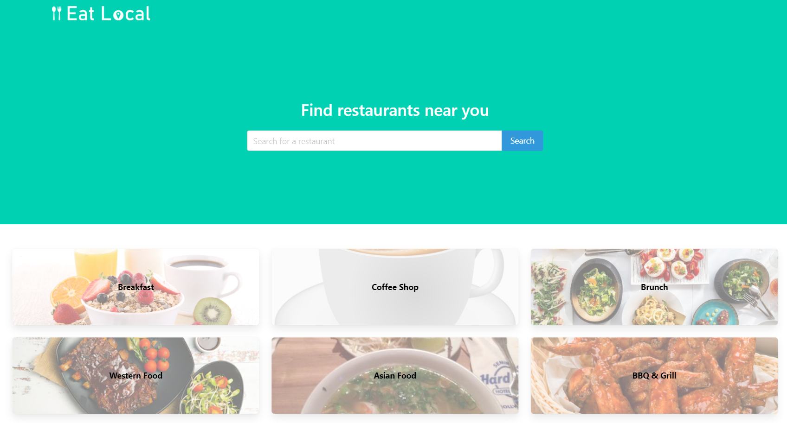
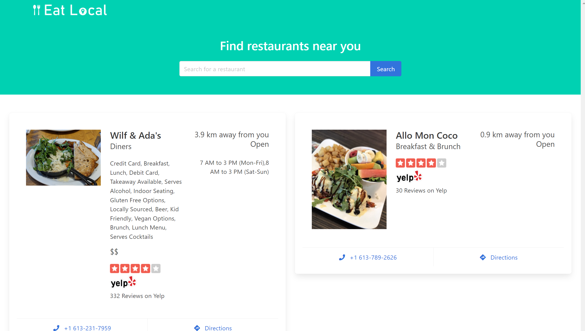
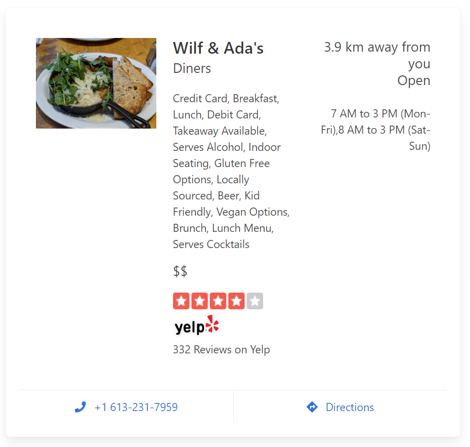

# Eat Local



:link: [View Eat Local](ziyonghe.github.io/eatlocal/index.html)

An app that shows restaurants near you! Search by keyword of what you're craving or click on a category provided if it catches your eye. _Eat Local_ focuses on restaurants within 10km of you so you can get to the food you want, faster.





## User Story

```
As a hungry, responsible citizen,
I want to search for restaurants near me
so that I can support local businesses
```

## Functionalities

1. The app will ask permission before getting your location
2. You can look for restaurants using the search bar or clicking on a category
3. View relevant data about the restaurants you searched for: rating, phone number, directions etc.

## License

This project is covered under the **MIT License**.

## Built with:

- [Zomato API](https://developers.zomato.com/api)
- [Yelp API](https://www.yelp.com/developers/documentation/v3/business_search)
- [Maps URLS](https://developers.google.com/maps/documentation/urls/get-started)
- [Bulma](https://bulma.io/documentation/)
- :heart:
